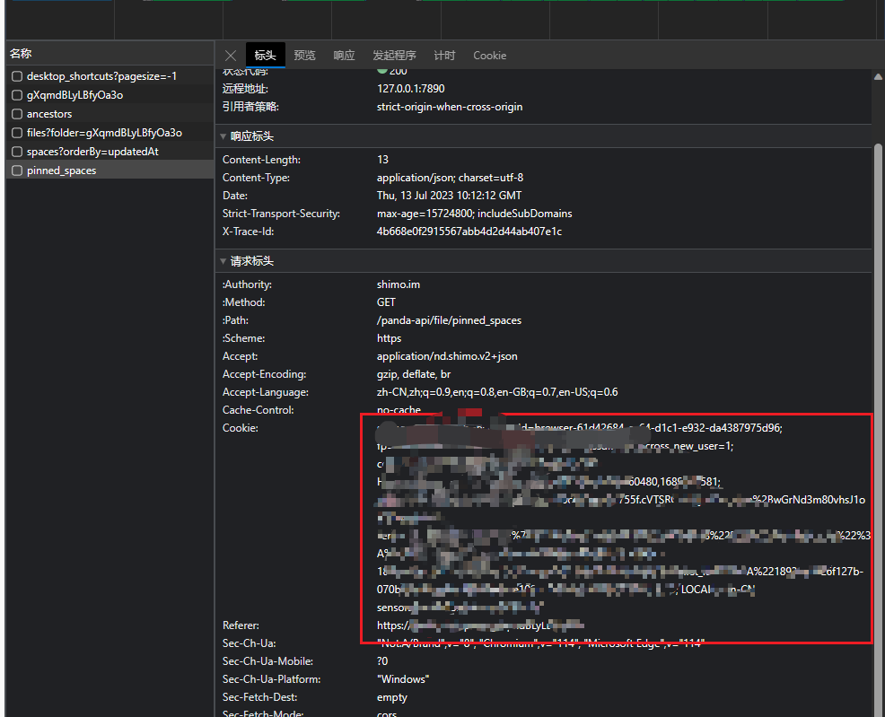
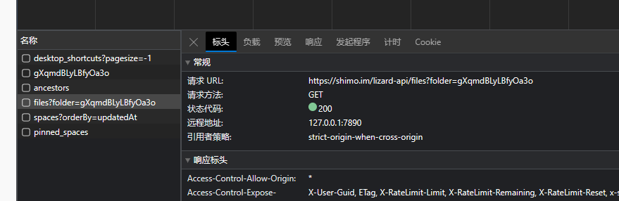
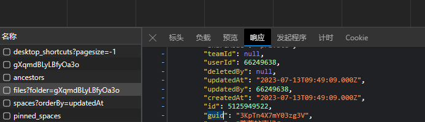

# shimoCrawer
将石墨文档的一个空间内所有文件创建副本到另一个空间

我有这样一个需求，就是将一个空间内的所有文件移动到另一个空间里。 比如说你创建了一个团队空间，你需要将团队空间内所有的文件
移动到”我的桌面“上，或者移动到另一个团队空间里。

石墨文档只支持文档的批量移动，但是不支持对文件夹的移动。

并且，当文档移动过去之后，名字上会多一个”副本“的前缀，比如文件名“你好”，移动过去就变成了“副本 你好”，我并不希望这样。

于是我就写了这样一个程序，写的也很简单。会在复制的过程中，把复制的数量和复制的文件名称实时打印出来。

# 使用步骤

1. 填充cookie
    
  可以在网站上登录石墨文档，然后随便找一个数据包，就能拿到cookie，放到程序的最上边的全局变量中。



2. 设置源目录和目标目录

程序中有这样一段代码：
```list = [{"25q5Mbx90pswMoqD": "gXqmdBLyLBfyOa3o"}]```

前面那个就是源目录，后面那个就是目标目录。也就是会把前面那个目录下的所有文件，移动到后面的那个目录中去。
这段字符串是每个文件，以及每个文件夹的唯一标识符。

当你点击某个文件的时候，找到下面的接口，然后从响应中，就能拿到“guid”，也就是上面的标识符了。




接下来你就可以直接开始程序了。

# 原理

1. 首先需要得到两个根目录的标识符，左边是源，右边是目的源。
2. 获取左边这个目录的信息，拿到这个文件夹下的文件和文件夹信息，如果是文件，直接在目的源下创建。
3. 如果是文件夹，需要先创建文件夹，再维护这个文件夹的guid到list中。
4. 在list移除当前这个已经创建过的元素。
5. 直到list中没有元素为止。

